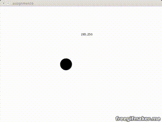
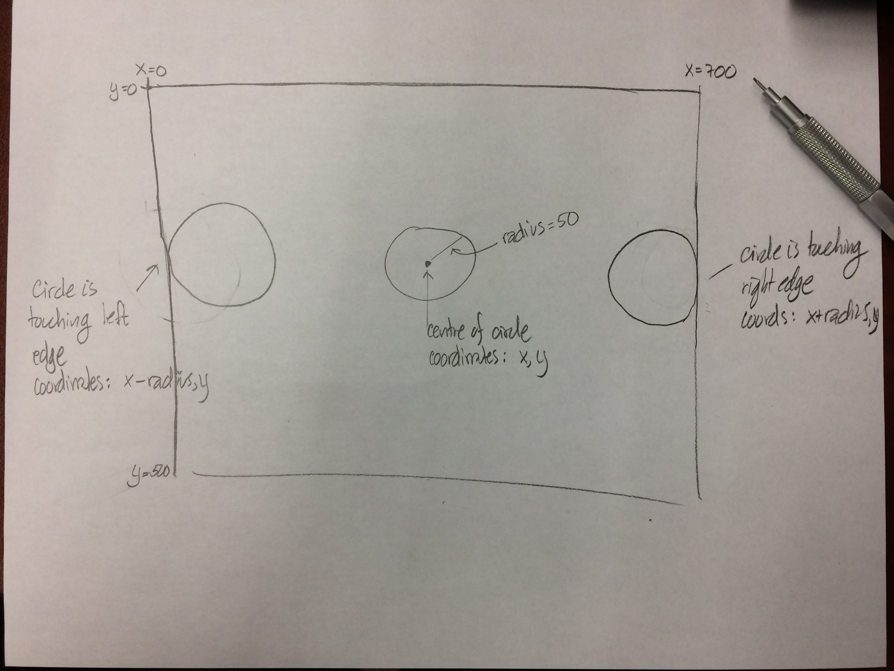

# processing-graphics-assignment-6-simple-animation

**[Assignment Standard Operating Procedures](https://mariopineda.github.io/assignment-sops/)**

Create a Processing program that does the following animation. 



You are only changing the x coordinate of the circle in the animation. For each new frame you can calculate the new x coordinate like this ```x = x + delta``` where ```delta``` is a positive number if the circle is moving to the right and a negative number if it is moving to the left. 

You will need to use an [if-statement](https://processing.org/reference/if.html) to determine the direction of movement. Your circle should start in the middle and start moving either left or right (initial direction does not matter). When it reaches one of the edges, the direction of the movement should reverse.

Review the [draw()](https://processing.org/reference/draw_.html) function to refresh your memory on how to animate in processing.

The basic steps are as follows:

1. Set delta to -1
2. Draw a circle with a radius of 50px in the middle of the canvas
3. Using an if-statement check if the edge of the circle is touching the left edge of the canvas, i.e. is x - radius = 0, if it is change the delta to +1 (switches direction from going left to going right)
4. Using another if-statement check if the edge of the circle is touching the right edge of the canvas, i.e. is x + radius = width of canvas, if it is change the delta to -1 (switches direction from going right to going left)
5. Add delta to the x coordinate 



## Bonus Challenge
Modify your code to include one, several or all of the following features:
- Having the circle slowly changing its background color as it is moving across the screen
- Including a second circle moving vertically across the canvas and bouncing off the bottom and top of the canvas.
- Having a "special effect" when the vertically and horizontyally moving circles collide, e.g. an "explosion", the circles bounce off each other, etc.
